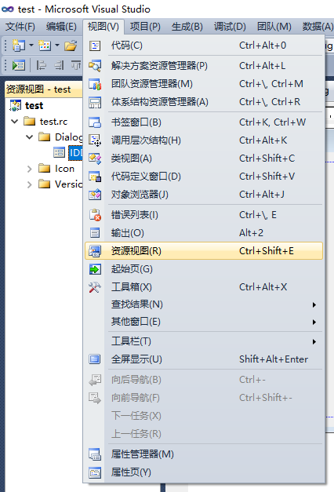
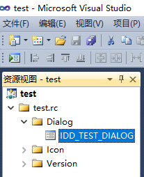
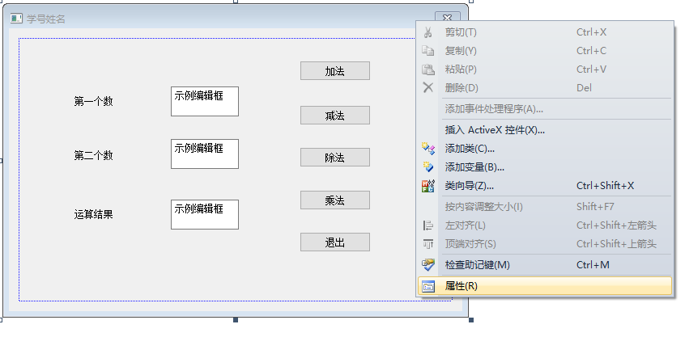
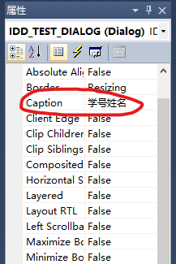

# MFC编程题

**个人不推荐更多地去学习 MFC，因为这是一个很老且过时的库。现代 C++ 的图形界面一般采用 Qt 或者 .NET 进行开发。我相信如果你对计算机感兴趣，以后是不会使用 MFC 进行开发的；如果你对计算机不感兴趣，以后也不会进行这方面的开发。**

**题目**：

设计一个简易计算器，从用户界面输入两个数，实现两个数的加、减、乘、除计算功能，并在界面中输出计算结果。请务必将窗口的标题栏（即caption属性）改为自己的学号姓名。

**说明**：

1. 3.zip 里面是 Visual Studio 2010 的工程文件，只需要解压后打开`test.sln`文件即可。

2. 如果打开之后没有看见程序窗口，可以打开在`视图`菜单选择`资源视图`，然后打开`Dialog`窗口。

   

   

3. 右键程序窗口，选择`属性`，在属性窗口中修改`Caption`属性为自己的学号、姓名。

   

   

4. 之后直接运行程序即可。

5. 双击右侧的五个按钮可以查看对应的函数。
