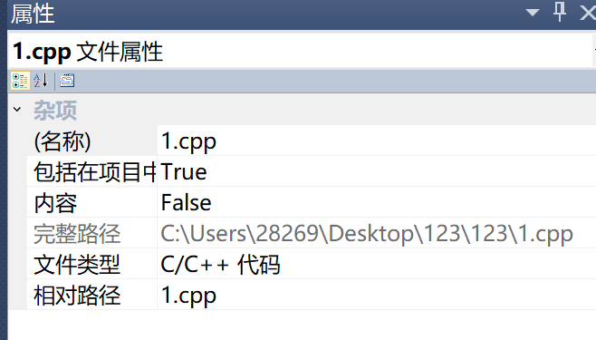
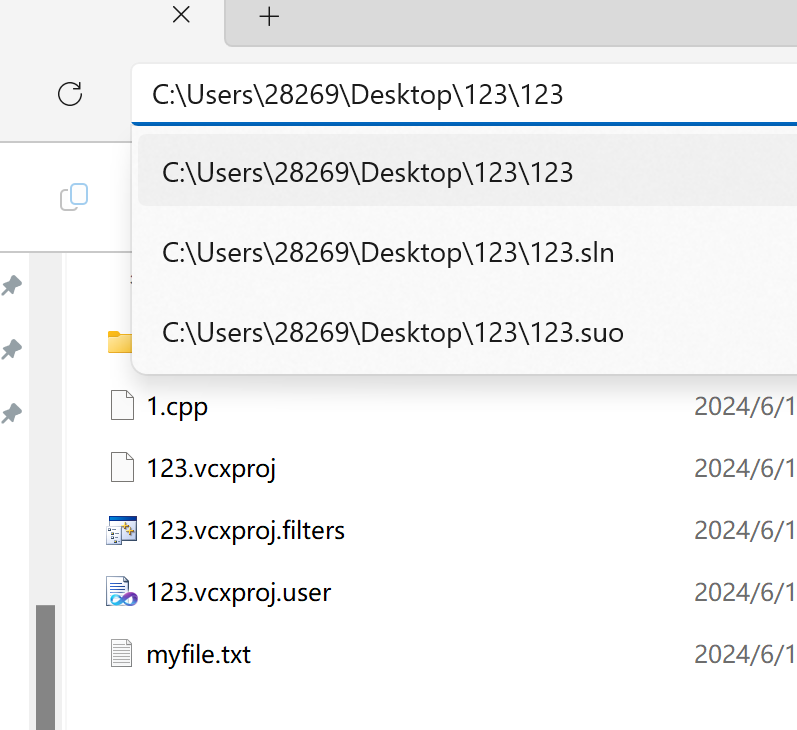

# 文件操作实验报告

本次实验报告涉及到找文件、修改文件位置的过程，如果不会，建议找同学在电脑上演示一下，或者看下面的教程。

1. 首先在左侧的`资源窗口管理器`选中 .cpp 文件，在右侧窗口找到文件的`完整地址`。

   

2. 然后在电脑上找到对应的地方。也可以直接在文件夹上面的导航栏输入去掉 `1.cpp` 后的文件地址。

   

如果不知道问谁，实在不行，直接在 [myfile](./myfile.txt)、[destination](./destination.txt)、[newsalary](./newsalary.txt) 这三个文件的第一行加上自己的姓名学号，直接截图。同时按照注释把代码修改一下，让它看起来像自己写的。

另外，由于 [myfile.txt](./myfile.txt) 是随机生成的字符，你可能需要随便改几个英文字母、符号。
